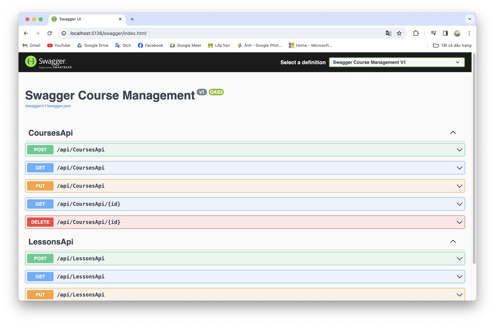
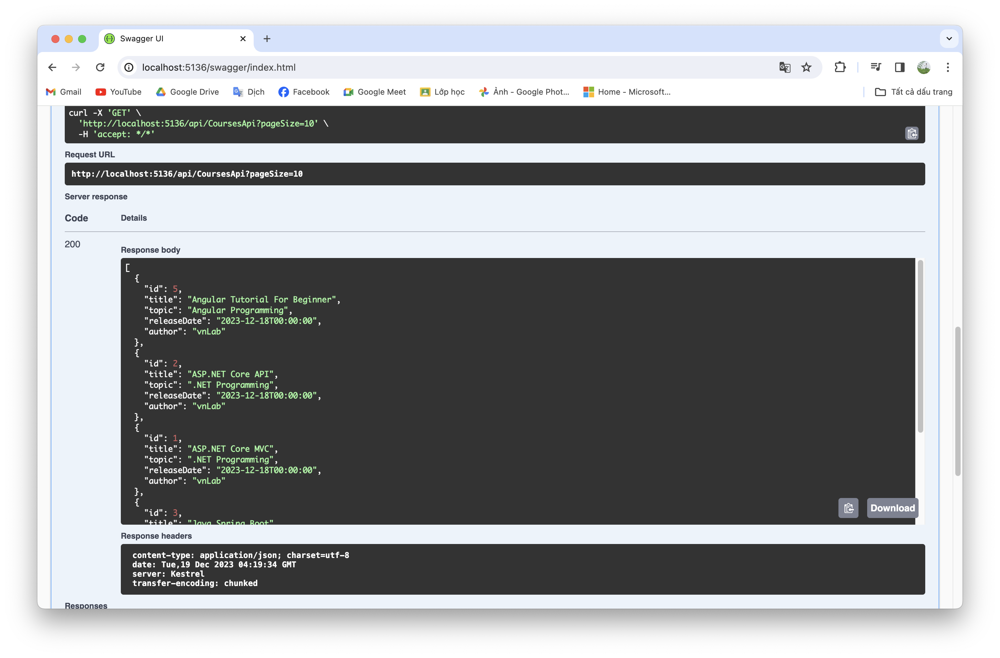

# Part 10: Create a web API with ASP.NET Core

>This tutorial teaches the basics of building a controller-based web API that uses a database. Another approach to creating APIs in ASP.NET Core is to create minimal APIs. For help in choosing between minimal APIs and controller-based APIs. For a tutorial on creating a minimal API, see [Tutorial: Create a minimal API with ASP.NET Core](https://learn.microsoft.com/en-us/aspnet/core/tutorials/min-web-api).

In this section:

- Add Swagger packages
- Add the API code
- Use Swagger for testing

Before coming to this guide, please refer to [File Storage](https://github.com/NguyenPhuDuc307/file-storage).

## Add a `Swagger` packages and configuration

Run the following .NET CLI commands:

```bash
dotnet add package Microsoft.AspNetCore.Grpc.Swagger
```

Configure `Swagger` in `Program.cs` with the following code:

```c#
// Swagger
builder.Services.AddSwaggerGen(c =>
{
    c.SwaggerDoc("v1", new OpenApiInfo { Title = "Swagger Course Management", Version = "v1" });
});

```

```c#
app.UseSwagger();

app.UseSwaggerUI(c =>
{
    c.SwaggerEndpoint("/swagger/v1/swagger.json", "Swagger Course Management V1");
});

```

## Add API Controller

Add `CoursesApiController.cs` with the following code:

```c#
using CourseManagement.Services;
using CourseManagement.ViewModels;
using Microsoft.AspNetCore.Mvc;

namespace CourseManagement.Controllers
{
    [ApiController]
    [Route("api/[controller]")]
    public class CoursesApiController : ControllerBase
    {
        private readonly ICoursesService _courseService;

        public CoursesApiController(ICoursesService courseService)
        {
            _courseService = courseService;
        }

        [HttpPost]
        public async Task<IActionResult> Create([FromForm] CourseRequest request)
        {
            if (!ModelState.IsValid)
                return BadRequest(ModelState);

            var result = await _courseService.Create(request);
            return Ok(result);
        }

        [HttpGet("{id}")]
        public async Task<IActionResult> GetById(int id)
        {
            if (!ModelState.IsValid)
                return BadRequest(ModelState);

            var result = await _courseService.GetById(id);
            return Ok(result);
        }

        [HttpGet]
        public async Task<IActionResult> GetAll(string? sortOrder, string? currentFilter, string? searchString, int? pageNumber, int pageSize = 10)
        {
            var result = await _courseService.GetAllFilter(sortOrder!, currentFilter!, searchString!, pageNumber, pageSize);
            return Ok(result);
        }

        [HttpDelete("{id}")]
        public async Task<IActionResult> Delete(int id)
        {
            var result = await _courseService.Delete(id);
            return Ok(result);
        }

        [HttpPut]
        public async Task<IActionResult> Update([FromForm] CourseViewModel request)
        {
            var result = await _courseService.Update(request);
            return Ok(result);
        }
    }
}
```

Add `LessonsApiController.cs` with the following code:

```c#
using CourseManagement.Services;
using CourseManagement.ViewModels;
using Microsoft.AspNetCore.Mvc;

namespace CourseManagement.Controllers
{
    [ApiController]
    [Route("api/[controller]")]
    public class LessonsApiController : ControllerBase
    {
        private readonly ILessonsService _lessonService;

        public LessonsApiController(ILessonsService lessonService)
        {
            _lessonService = lessonService;
        }

        [HttpPost]
        public async Task<IActionResult> Create([FromForm] LessonRequest request)
        {
            if (!ModelState.IsValid)
                return BadRequest(ModelState);

            var result = await _lessonService.Create(request);
            return Ok(result);
        }

        [HttpGet("{id}")]
        public async Task<IActionResult> GetById(int id)
        {
            if (!ModelState.IsValid)
                return BadRequest(ModelState);

            var result = await _lessonService.GetById(id);
            return Ok(result);
        }

        [HttpGet]
        public async Task<IActionResult> GetAll(string? sortOrder, string? currentFilter, string? searchString, int? courseId, int? pageNumber, int pageSize = 10)
        {
            var result = await _lessonService.GetAllFilter(sortOrder!, currentFilter!, searchString!, courseId, pageNumber, pageSize);
            return Ok(result);
        }

        [HttpDelete("{id}")]
        public async Task<IActionResult> Delete(int id)
        {
            var result = await _lessonService.Delete(id);
            return Ok(result);
        }

        [HttpPut]
        public async Task<IActionResult> Update([FromForm] LessonViewModel request)
        {
            var result = await _lessonService.Update(request);
            return Ok(result);
        }
    }
}
```

Here, I have injected the ILessonsService and ICoursesService dependencies into the controllers.

Add button Explore API to the `Home/Index` page:

```html
<h2><a class="btn btn-primary" href="/swagger">Explore APIs</a></h2>
```

**Final, run the application to test functions:**

Run the following command:

```bash
dotnet watch run
```



Let's try calling one method to see the results:



Refer to the [Create web APIs with ASP.NET Core](https://learn.microsoft.com/en-us/aspnet/core/web-api/) by `Microsoft`.

Next let's [HttpClient](https://github.com/NguyenPhuDuc307/http-client).
